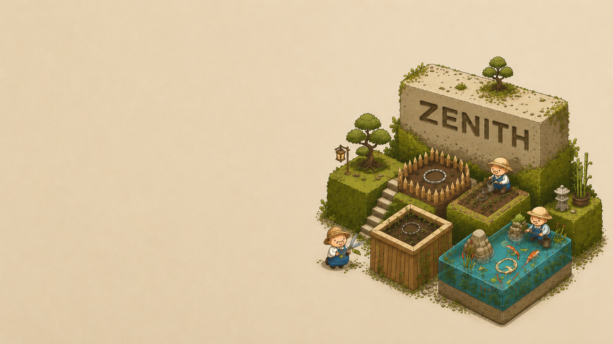

<p align="center">
  
</p>

<h1 align="center">⛦ Zenith Open Source Projects</h1>

<p align="center">
  <em>"Open Source is the First Step of Development."</em>
</p>

<p align="center">
  <a href="https://github.com/roshhellwett/zenithopensourceprojects/blob/main/license"></a>
  <a href="https://nextjs.org/"></a>
  <a href="https://tailwindcss.com/"></a>
  <a href="https://groq.com/"></a>
</p>

---

**Zenith** is a digital portfolio and project registry for open-source civic-tech tools, automation pipelines, and developer utilities. Built in India, designed for the global developer ecosystem.

The website features a unique **dual-mode interface** — a retro CRT Desktop OS experience and a modern PostHog-inspired marketing site — both running on the same codebase.

## ✦ Features

| Feature | Description |
|---------|-------------|
| 🖥️ **Desktop OS Mode** | A retro CRT-style desktop with draggable windows, taskbar, dock icons, and file explorer |
| 🌐 **Website Mode** | A polished PostHog-inspired marketing site with hero, project cards, and tech stack sections |
| 🤖 **Zenith AI Chat** | AI assistant powered by Groq (Llama 3.3) — answers questions about projects, tech stack, and more |
| 📁 **Project Registry** | Interactive dashboard grouping projects by category (Civic-tech, AI, Bots, Linux, Systems) |
| 📊 **Engineering Telemetry** | Live commit cadence heatmap simulating deployment pipeline activities |
| 🎨 **Isometric Art Background** | Custom hand-crafted isometric background with pixel-perfect rendering |
| ⚡ **Auto-cycling Feature Tabs** | Animated tabs that auto-rotate through project categories |

## ✦ Tech Stack

| Layer | Technologies |
|-------|-------------|
| **Framework** | Next.js 16 (App Router, React 19) |
| **Styling** | Tailwind CSS v4 + PostCSS |
| **Animations** | Framer Motion |
| **Icons** | Custom SVG icon system + Lucide React |
| **AI** | Groq API (Llama 3.3 70B) |
| **Deployment** | Vercel |

## ✦ Getting Started

### Prerequisites

- [Node.js](https://nodejs.org/) v20.x or later
- `npm` (comes with Node.js)
- A [Groq API key](https://console.groq.com/keys) (free — optional, for AI chat)

### Installation

```bash
# 1. Clone the repository
git clone https://github.com/roshhellwett/zenithopensourceprojects.git
cd zenithopensourceprojects

# 2. Install dependencies
npm install

# 3. Set up your environment variables
cp .env.example .env.local   # Unix/macOS
copy .env.example .env.local  # Windows
```

> **Note:** Use the appropriate command for your OS — **Unix/macOS:** `cp .env.example .env.local` · **Windows:** `copy .env.example .env.local`

### Setting up the Groq API Key

1. Go to [console.groq.com](https://console.groq.com) and sign up (free)
2. Navigate to **API Keys** in the left sidebar
3. Click **Create API Key** and copy it
4. Open `.env.local` and replace the placeholder:

```env
GROQ_API_KEY=gsk_your_actual_key_here
```

> **Note:** The AI chat works in demo mode without a key — it shows pre-written responses. Set the key to enable live AI conversations.

### Running Locally

```bash
# Development server (with hot reload)
npm run dev

# Production build
npm run build
npm start
```

Open [http://localhost:3000](http://localhost:3000) in your browser.

## Worker Setup (AI Backend)

The `worker/` subdirectory is a standalone Express server that handles AI chat requests to Groq.

1. `cd worker`
2. `cp .env.example .env.local` (or `copy .env.example .env.local` on Windows)
3. Set your `GROQ_API_KEY` in `worker/.env.local`
4. `npm install`
5. `npm run dev` (hot-reloads with tsx)

See [worker/README.md](worker/README.md) for deployment instructions.

## ✦ Project Structure

```
zenithopensourceprojects/
├── app/                    # Next.js App Router
│   ├── api/ai/chat/        # Groq AI chat endpoint
│   ├── globals.css          # Design system & theme tokens
│   ├── layout.tsx           # Root layout with SEO metadata
│   └── page.tsx             # Main page (mode controller)
├── components/
│   ├── Navbar.tsx           # Shared navigation bar
│   ├── DesktopMode.tsx      # CRT desktop OS interface
│   ├── DesktopWindow.tsx    # Draggable window component
│   ├── DesktopIcon.tsx      # Custom SVG icon renderer
│   ├── WebsiteMode.tsx      # PostHog-style marketing site
│   ├── ChatPanel.tsx        # AI chat panel
│   └── apps/               # Desktop window apps
│       ├── HomeApp.tsx
│       ├── RegistryApp.tsx
│       ├── StackApp.tsx
│       └── ...
├── data/
│   ├── repos.ts             # Project registry data
│   ├── nav.ts               # Navigation structure
│   └── desktop-icons.ts     # Desktop icon definitions
├── public/
│   └── desktop_background.png  # Isometric background art
├── .env.example             # Environment template
└── package.json
```

## ✦ Deployment

### Vercel (Recommended)

1. Push to GitHub
2. Import the repo on [vercel.com](https://vercel.com)
3. Add `GROQ_API_KEY` in **Settings → Environment Variables**
4. Deploy!

### Other Platforms

Any platform that supports Next.js works — Netlify, Railway, Render, etc. Just ensure:
- Node.js 18+ runtime
- `GROQ_API_KEY` environment variable is set
- Build command: `npm run build`
- Start command: `npm start`

## ✦ Contributing

Contributions are welcome! See [CONTRIBUTING.md](CONTRIBUTING.md) for guidelines.

This project follows the [Contributor Covenant](CODE_OF_CONDUCT.md) code of conduct.

## ✦ Design Credits

- **Design inspired by** [PostHog](https://posthog.com/) — the open source product analytics platform
- **AI powered by** [Groq](https://groq.com/) — ultra-fast LLM inference
- **Background art** — custom isometric illustration

## ✦ License

This project is licensed under the **MIT License** — see [LICENSE](license) for details.

---

<p align="center">
  <strong>Created and maintained by <a href="https://github.com/roshhellwett">Roshan Kr Singh (@roshhellwett)</a></strong><br/>
  Independent developer, systems engineer, and Google Dev member based in India.
</p>
